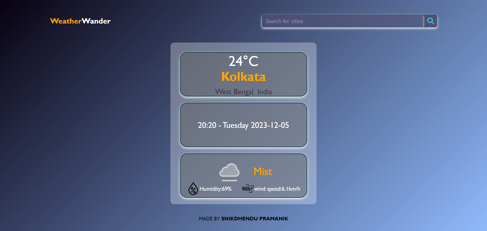

# Weather App

This Weather App allows users to check the current weather conditions for different cities. The app provides information such as temperature, location, date, and weather conditions.

## Table of Contents
- [Features](#features)
- [Usage](#usage)
- [Screenshots](#screenshots)
- [Installation](#installation)
- [Contributing](#contributing)
- [License](#license)
- [Author](#author)

## Features
- Current temperature display
- City search functionality
- Weather condition and additional details (humidity, wind speed)
- Responsive design for both desktop and mobile devices

## Usage
1. Open `index.html` in your web browser.
2. Enter the name of the city you want to check in the search box.
3. Click the search button to get the weather details for the specified city.

## Screenshots

## Installation
No installation is required. Simply open this [Weather App](https://snik-weather-app.vercel.app/)

## Contributing
If you'd like to contribute to this project, feel free to fork the repository and submit a pull request.

## License
This project is licensed under the [MIT License](LICENSE).

## Author
Made with ❤️ by [Snikdhendu Pramanik](https://snikdhendu-pramanik.vercel.app/)

